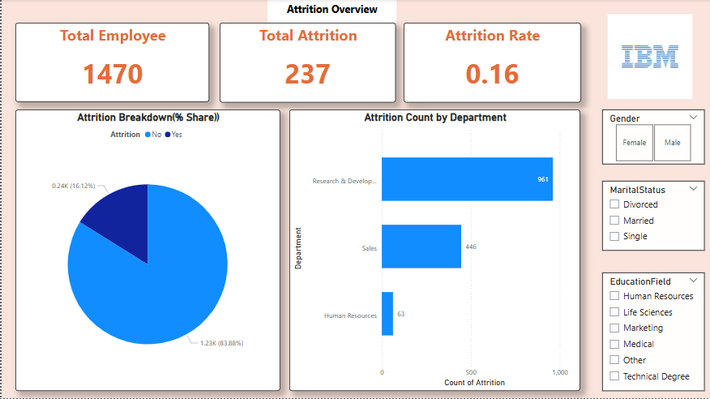
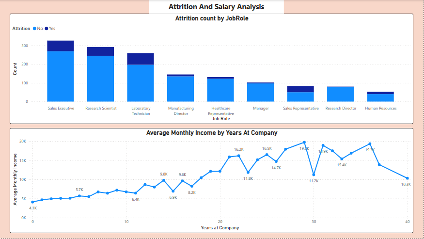
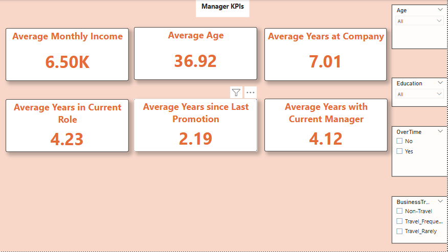

# Employee Attrition Prediction Project

## Objective:
Predict whether an employee is likely to leave the organization based on historical HR data. This helps HR teams take proactive measures to retain valuable talent.

---

## Tools & Technologies Used:
- **SQL**: For initial data exploration and feature extraction
- **Python**: For EDA, preprocessing, and building a predictive model
- **Power BI**: For interactive dashboard visualization

---

## Project Workflow:

1. **Data Exploration with SQL**  
   Used SQL queries to understand employee distribution, attrition rates, average income by department, job roles, etc.

2. **Data Analysis & Modeling in Python**  
   - Performed Exploratory Data Analysis (EDA)  
   - Feature engineering & preprocessing  
   - Built classification models to predict attrition  
   - Achieved ~90% accuracy

3. **Power BI Dashboard**  
   Created a dynamic dashboard to visualize patterns and KPIs related to attrition.

---

## Power BI Dashboard Overview:

1. **Attrition Overview**
   - Total number of employees vs attrition count , attrition %
   - Attrition distribution by gender, marital status, and education field

2. **Attrition & Salary Analysis**
   - Average income vs years at company trend (attrited vs active)
   - Job role-wise attrition insights

3. **Manager KPIs**
   - Average monthly income , Average age, Average year since last promotion etc
   - Interactive KPIs like Overtime, Business Travel 
   - Tenure impact on attrition

---

## Dashboard Snapshots:

---

## Conclusion:
By combining SQL, Python, and Power BI, this project offers a data-driven approach to employee retention, helping HR professionals make strategic decisions based on actionable insights.
